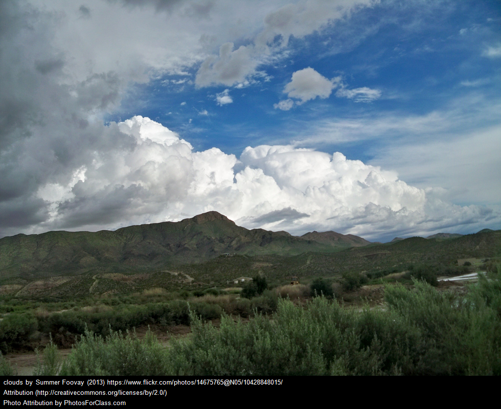
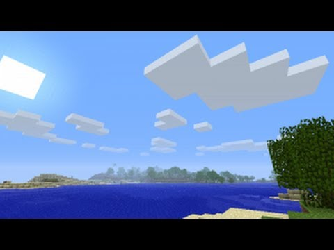
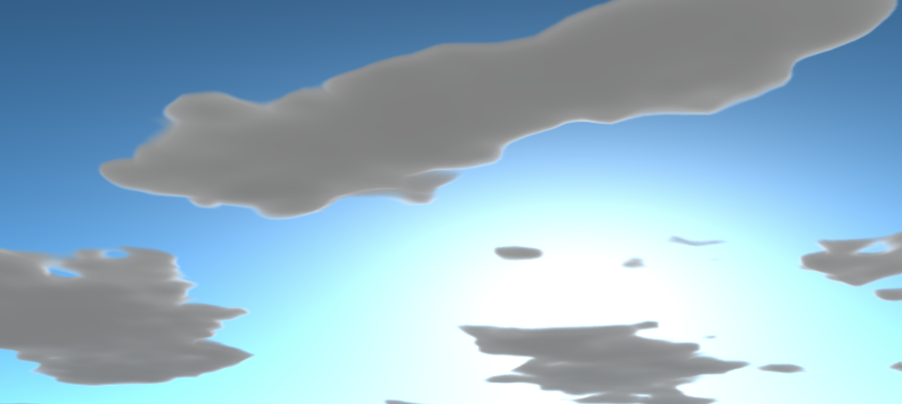
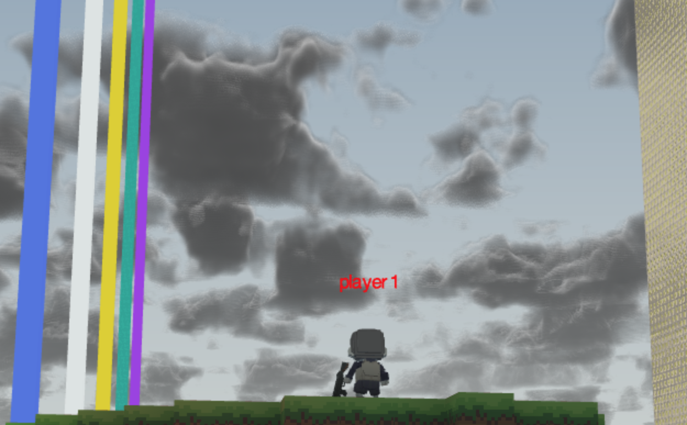

# Cloud-Development
My process in writing a skybox with limited experience

... in China. 

This summer (the summer of 2018), I was invited for an internship by one of my classmates at RPI, [Yuze Ma](https://github.com/bobmayuze) at the Chinese company [Codemao](codemao.cn). Naturally, going overseas without understanding even 一点中文 was a great idea. So there I was, in China, and assigned to the graphics team of a game engine under supervision of [Mikola Lysenko](https://github.com/mikolalysenko). He provided me one simple task: Make clouds. [Skip the cloud bs and read about China stuff](#china)

Ok seems easy right, we've all seen clouds: 

  

## Cool.

So how hard could it be to make them? Well, first off, it turns out Mikola (aka mik) is also one of the developers of [regl](https://github.com/mikolalysenko/regl), a wrapper for webgl, so I would first have to learn webgl and regl. Also, the codebase is written in [typescript](https://github.com/Microsoft/TypeScript), and seeing as I didn't even know js it was looking pretty rough. However, after one training montage I was ready to start making some clouds.

To begin, I learned from [the best](https://www.shadertoy.com/). and pieced together a github test envrionment that mirrored the codebase without fear of stumbling through mysterious things like ~client server interactions~, ~regl contexts~, and ~well written code~. [This](https://github.com/Maydit/regl-cloudtest) is what I came up with. As you can see in the earlier stages, it's a simple raymarcher, but let's be honest, I didn't really know exactly what that meant when I started this either, so I'll explain it for you: [skip this](#marching-forward)

Graphics is composed in a series of steps, called the graphics pipeline, where the input polygons are converted into pixels and the pixels are given colors. This pipeline is executed by shaders (programs written in shader language) on the GPU. Regl made it super simple to [~~copy~~ borrow some code](https://github.com/regl-project/regl/tree/master/example) and just write a shader, so I guess you don't really need to know that, but what is important is that the (fragment) shader takes the input pixel and outputs its color. In this case, I had to take the pixel and give it either a sky color output or a cloud color output. Doing this with raymarching means that the input pixel is converted to a world direction (in the form of a vector) and the shader follows that vector for a certain amount of steps to 'see' what's in that direction, gets its color, and returns it.

## Marching forward

This raymarcher does what the useful reference sources do and samples a [perlin noise](https://en.wikipedia.org/wiki/Perlin_noise) generator for the density of the cloud, and uses that density as the opacity of the cloud. For the cloud's lighting, at each point where the density is nonzero, a secondary ray is marched towards the sun, samples the same density function, and uses this value to shade the cloud darker based on the obsruction.

At a first test, this produced some beautiful clouds:

After a rude awakening to aliasing, I produced this beauty:

## Packing up

Ok, looks good, after that I was completely done. Jk jk. These clouds look like sausages or pillows, but really who cares? Mik cares. So I must do better. After a rework to the density function that destroyed the lighting calculations, I arrived at this:

It was fully customizable, too, with a day and night cycle. (Prior to this there was only an atmosphere). As uniforms (shader inputs), there was cloud height, thickness, absorbtion, coverage, and darkness as you can still see on the github page. This was fully awesome, so I worked hard to implement it in the codebase and merge it in.

One successful merge later and it was in the codebase. Next, I fixed the lighting and tweaked the blending to give some truly fluffy clouds, with accurate contours:

Good enough stuff, and all done in about a month, including the time to learn glsl/js and fail a lot. It was at this point I took a break from developing clouds to work on other skybox related code.

## Lightmap calcs

In adding the day and night cycle, the world didn't seem right being the same brightness all the time. The fix for this is calculating the lightmap values directly from the skybox. Mik told me specifically what should happen: create a [headless gl](https://github.com/stackgl/headless-gl) environment and render each direction for the lightmap to read from and take the [integral of the image](https://computersciencesource.wordpress.com/2010/09/03/computer-vision-the-integral-image/) to produce a value between 0 and 1 of the total brightness in red, green, and blue. To do this in gl, all you have to do is take your frenet-seret frame in the direction you're looking, convert the coordinates of each pixel from the frame's polygon into its corresponding position on the unit sphere, render the skybox in that normal's direction, then integrate. To do the integration with enough detail, we can pack the double of the red, green, and blue into the channels of the shader (RGBA = 32 bits of info) and unpack them afterwords. Lastly, don't forget the Jacobian. In this case, it's equal to the determinant of the [first fundamental form](https://en.wikipedia.org/wiki/First_fundamental_form) of the surface we're using, with respect to the x and y of the initial frame we used because the surface is parametrized in Θ and Φ. 

This integration gives enough information to calculate the lightmaps at 64 predetermined times, so the engine can simply interpolate between the nearest two at any other time.

## Back to the cloudz

This intermission gave the dev team enough time to complain about one small oversight: efficiency. My clouds, however beautiful they may have been, took ***100ms per frame*** to calculate along with the skybox. If you've worked on or played a game before you know there should be 60 frames per second, and quick maffs tells us that 100ms per frame will give us ***10*** frames per second. So WTF.
