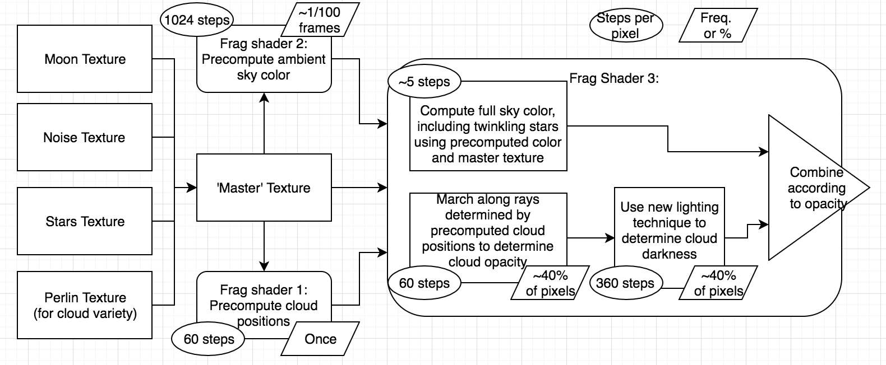

# Cloud-Development
My process in writing a skybox with limited experience

... in China. 

This summer (the summer of 2018), I was invited for an internship by one of my classmates at RPI, [Yuze Ma](https://github.com/bobmayuze) at the Chinese company [Codemao](codemao.cn). Naturally, going overseas without understanding even 一点中文 was a great idea. So there I was, in China, and assigned to the graphics team of a game engine under supervision of [Mikola Lysenko](https://github.com/mikolalysenko). He provided me one simple task: Make clouds. [Skip the cloud bs and read about China stuff](./read-more/china.md)

Ok seems easy right, we've all seen clouds: 

  

## Cool.

So how hard could it be to make them? Well, first off, it turns out Mikola (aka mik) is also one of the developers of [regl](https://github.com/mikolalysenko/regl), a wrapper for webgl, so I would first have to learn webgl and regl. Also, the codebase is written in [typescript](https://github.com/Microsoft/TypeScript), and seeing as I didn't even know js it was looking pretty rough. However, after one training montage I was ready to start making some clouds.

To begin, I learned from [the best](https://www.shadertoy.com/). and pieced together a github test envrionment that mirrored the codebase without fear of stumbling through mysterious things like \~client server interactions\~, \~regl contexts\~, and \~well written code\~. [This](https://github.com/Maydit/regl-cloudtest) is what I came up with. As you can see in the earlier stages, it's a simple raymarcher, but let's be honest, I didn't really know exactly what that meant when I started this either, so I'll explain it for you: [skip this](#marching-forward)

Graphics is composed in a series of steps, called the graphics pipeline, where the input polygons are converted into pixels and the pixels are given colors. This pipeline is executed by shaders (programs written in shader language) on the GPU. Regl made it super simple to [~~copy~~ borrow some code](https://github.com/regl-project/regl/tree/master/example) and just write a shader, so I guess you don't really need to know that, but what is important is that the (fragment) shader takes the input pixel and outputs its color. In this case, I had to take the pixel and give it either a sky color output or a cloud color output. Doing this with raymarching means that the input pixel is converted to a world direction (in the form of a vector) and the shader follows that vector for a certain amount of steps to 'see' what's in that direction, gets its color, and returns it.

## Marching forward

This raymarcher does what the useful reference sources do and samples a [perlin noise](https://en.wikipedia.org/wiki/Perlin_noise) generator for the density of the cloud, and uses that density as the opacity of the cloud. For the cloud's lighting, at each point where the density is nonzero, a secondary ray is marched towards the sun, samples the same density function, and uses this value to shade the cloud darker based on the obsruction.

At a first test, this produced some beautiful clouds:

After a rude awakening to aliasing, I produced this beauty:

## Packing up

Ok, looks good, after that I was completely done. Jk jk. These clouds look like sausages or pillows, but really who cares? Mik cares. So I must do better. After a rework to the density function that destroyed the lighting calculations, I arrived at this:

It was fully customizable, too, with a day and night cycle. (Prior to this there was only an atmosphere). As uniforms (shader inputs), there was cloud height, thickness, absorbtion, coverage, and darkness as you can still see on the github page. This was fully awesome, so I worked hard to implement it in the codebase and merge it in.

One successful merge later and it was in the codebase. Next, I fixed the lighting and tweaked the blending to give some truly fluffy clouds, with accurate contours:

Good enough stuff, and all done in about a month, including the time to learn glsl/js and fail a lot. It was at this point I took a break from developing clouds to work on other skybox related code.

## Lightmap calcs

In adding the day and night cycle, the world didn't seem right being the same brightness all the time. The fix for this is calculating the lightmap values directly from the skybox. Mik told me specifically what should happen: create a [headless gl](https://github.com/stackgl/headless-gl) environment and render each direction for the lightmap to read from and take the [integral of the image](https://computersciencesource.wordpress.com/2010/09/03/computer-vision-the-integral-image/) to produce a value between 0 and 1 of the total brightness in red, green, and blue. To do this in gl, all you have to do is take your frenet-seret frame in the direction you're looking, convert the coordinates of each pixel from the frame's polygon into its corresponding position on the unit sphere, render the skybox in that normal's direction, then integrate. To do the integration with enough detail, we can pack the double of the red, green, and blue into the channels of the shader (RGBA = 32 bits of info) and unpack them afterwords. Lastly, don't forget the Jacobian. In this case, it's equal to the determinant of the [first fundamental form](https://en.wikipedia.org/wiki/First_fundamental_form) of the surface we're using, with respect to the x and y of the initial frame we used because the surface is parametrized in Θ and Φ. 

This integration gives enough information to calculate the lightmaps at 64 predetermined times, so the engine can simply interpolate between the nearest two at any other time.

## Back to the cloudz

This intermission gave the dev team enough time to complain about one small oversight: efficiency. My clouds, however beautiful they may have been, took ***100ms per frame*** to calculate along with the skybox. If you've worked on or played a game before you know there should be 60 frames per second, and quick maffs tells us that 100ms per frame will give us ***10*** frames per second. So WTF.

To fix this issue, I had to see exactly what was going on and what my pipeline looked like. So I took a simple [regl gpu profiler](https://github.com/Erkaman/regl-stats-widget/blob/master/index.js), enabled the firefox timer extension that was disabled due to timing attacks (thanks hackers), and stared at my laggy clouds.

This gave a rundown of 10ms per frame being used to compute the atmospheric scattering and the other 90 being used to calculate the clouds themselves. By turning off the secondary ray for lighting, the clouds shapes themselves took 30 of these ms. For those who enjoy tables:

| Element | milliseconds per frame |
| :------- | -------------: |
| Sky color | 10 |
| Cloud shape | 30 |
| Cloud lighting | 60 |
| Total | 100 |

Looking at the pipeline, we can see why this is:

With Mik's infinite knowledge there were several clear optimizations:

 - Bake the sky color
 - Squash the textures
 - Precompute the cloud positions
 - Do the lighting better

Thanks Mik. 

### Baking the sky color

Since the sky color only updates when the sun moves, not every frame, we can simply bake the sky color into a texture and update it periodically. This is pretty simple with the use of [framebuffers](https://github.com/regl-project/regl/blob/gh-pages/API.md#framebuffers). This gave an improvement in the sky color calculation, reducing the time per frame from 10ms to 0.5ms when the framebuffer is not being updated and 2.5 ms when the framebuffer is being updated. The loss in quality is negligable and of course the framebuffer update can be [amortized](https://en.wikipedia.org/wiki/Amortized_analysis).

### Squashing the textures

This was a pretty simple fix: the noise function only uses the R channel of the texture, the moon is greyscale, and the stars only use the alpha channel and a blue channel for twinkling, so we can compress these four textures into one. This was probably the greatest time save, bringing the cloud rendering from 90ms per frame to about 30ms.

### Precomputing the cloud positions

Since the clouds are in the same spots (if we remove the wind), we can optimize them by precomputing which parts of the sky have clouds and only raytracing those parts. We use another framebuffer for this, which is created once and not updated. 

### Etc

In this time I also ripped out all the options for the clouds, people don't know what they want anyway. This reduced the uniforms significantly.

### Doing the lighting better

Useful tip. But how? For this I looked to the greats, and I don't mean shadertoy this time, but [Horizon Zero Dawn](http://killzone.dl.playstation.net/killzone/horizonzerodawn/presentations/Siggraph15_Schneider_Real-Time_Volumetric_Cloudscapes_of_Horizon_Zero_Dawn.pdf). HZD implements volumentric clouds very similarily to how I was implementing them, and also went through the troubles of optimizing them. For lighting specifically, they sample 6 times in a cone instead of marching a ray. I implemented this approach and suddenly the clouds were taking 10 ms to render. There are a few details in the full implementation of the lighting, so if you want to read all about the lighting specifically, [see this](./read-more/lighting.md)

This is what the pipeline looked like after this series of optimizations:

And these were the timings:

| Element | milliseconds per frame |
| :------- | -------------: |
| Sky color | 0.5 |
| Cloud shape | 3 |
| Cloud lighting | 7 |
| Total | 10.5 |

## What's left?

At this point, the clouds were almost done. The only things left were

 - Readd wind
 - Make the clouds more dynamic
 - Add lighting and coloring to the clouds

but honestly if the clouds were left in that PR it would have been fine.

Not really, those clouds look so bad. There's banding and they're just white... To fix this I added the colors, which also reduced the banding drastically. You can read about the coloring in depth [here](./read-more/lighting.md). For wind, because we previously assumed that the clouds would not move, we now have to update the cloud positions. Luckily, this can be amortized using two framebuffers that are swapped once every 100 frames and updated using the [scissor](https://github.com/regl-project/regl/blob/gh-pages/API.md#scissor) property. Making the clouds more dynamic was a more difficult task. I tried several approaches: 

First, I tried updating single pixels of the noise texture gradually. The idea here was that the perlin noise function reads from a 256 x 256 texture of random ints (0-255), so we can increment or decrement one of these bits to change the noise source and linearly smooth between the old and the new. This seemed like it would work in theory and was implemented using two framebuffers, one with the previous noise and one with the next noise. For some reason though, the changes in the cloud shapes were discontinuous. If anyone reading this can figure out why this happened please raise an issue or ask for more details.

Next, I tried linearly smoothing within the shader using offsets, but this proved too challenging to figure out, so I went to for the following.

Last approach: thank stubbe for creating [this](https://www.shadertoy.com/view/XltSWj), which does exactly what I was looking for. The only downside was that I would have to decouple the noise from the other textures, as this noise requires four channels. It only takes one read compared to the two reads I was doing before, so it was a net increase in speed.

This gives the following pipeline:

With all of these changes and the clouds looking pretty sweet - 

I relaxed and implemented some bonus minecraft clouds too.

At the end of the day, clouds are stupid. Rendering fake clouds is even stupider. But here we are after two months of this internship. Here's what I can say for those of you looking to implement clouds: hack it however you can, or do the opposite and go for extreme fidelity. There are many resources you can use to help you [1 - HZD](http://killzone.dl.playstation.net/killzone/horizonzerodawn/presentations/Siggraph15_Schneider_Real-Time_Volumetric_Cloudscapes_of_Horizon_Zero_Dawn.pdf) [2 - Nubis](https://d1z4o56rleaq4j.cloudfront.net/downloads/assets/Nubis-Authoring-Realtime-Volumetric-Cloudscapes-with-the-Decima-Engine-Final.pdf?mtime=20170807141817) [3 - Frostbite](https://media.contentapi.ea.com/content/dam/eacom/frostbite/files/s2016-pbs-frostbite-sky-clouds-new.pdf) [4 - Basic stuff](http://www.cse.chalmers.se/~uffe/xjobb/RurikH%C3%B6gfeldt.pdf). Of course, some of this stuff may be outdated now. Lastly, don't forget to look outside for inspiration too, some of the most productive minutes of development were formed looking out of a didi.
